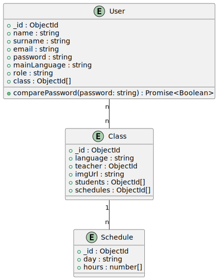

# Gestor de idiomas: Colegio de idiomas

## ¿Qué es?

El **'Colegio de idiomas'** es un proyecto que resolverá las necesidades de los profesores y alumnos a la hora de conocer los datos relevantes de cada asignatura.

&nbsp;

## ¿Qué ofrece esta aplicación?

- Gestión de usuarios por roles
- Gestión de clases por roles
- Asignación global de clases
- Gestión de horarios por roles

## ¿Cómo se usa?

La aplicación está diseñada para ser usada con **Node.js** y **MongoDB**.

Pasos para la instalación y uso:

1. Descargar o clonar el repositorio.
2. Instalar los paquetes con el comando `npm i` tanto en la carpeta raíz como en sus subcarpetas **'backend'** y **'frontend'**.
3. Regresar a la carpeta raíz y ejecutar el comando `npm run dev`.
4. Tras unos segundos, podrás iniciar la app web en la URL correspondiente.

## ¿Cómo está diseñada la App?

La app está relacionada por ID entre varios documentos gracias a la API, ya que utiliza una base de datos no relacional como **MongoDB**.

La API cuenta con varios métodos de tipo CRUD y otros más específicos, como obtener el rol de una persona o identificar cuáles serán los próximos horarios de cada clase.

### Login

El sistema de registro dispone de dos formularios diferentes que cambian dependiendo de si el usuario desea registrarse o iniciar sesión.

Dependiendo de la decisión, se realizará un **fetch** diferente con sus respectivas comprobaciones:

- **Registro**:

  - **Fetch**: `/register`
  - Comprobación de que el body se haya enviado correctamente.
  - Comprobación de que el email no está repetido.
  - Creación de un nuevo usuario con los datos introducidos y **solamente con el rol de student**.

- **Inicio de sesión**:
  - **Fetch**: `/login`
  - Comprobación de que el body se haya enviado correctamente.
  - Comprobación de que existe un usuario con ese email.
  - Comprobación de que la contraseña es correcta.
  - Generación y envío de un token.
 
- **Verificación de token**:
  - **Fetch**: `/verify`
  - Comprobación de que el usuario esté logeado.
  - Devuelve el usuario y un booleano 'authorized' para que el routing determine si puede acceder a la app.

 ### Home

 El home sera la interfaz principal de la aplicación, todos los modulos disponibles para usuarios y profesores se encuentran aquí.

- **Modulo de próximas clases**:
  Muestra la información de las proximas clases en funcion del horario local.
  
  - **Fetch**: `/classesNext`
  - Comprobaciónd e los ids pasados en el body.
  - Buscar las clases con esos ids.
  - Procesa los horarios de dichas clases para determinar el proximo horario.
  - Devuelve un custom dto con la informacion de la proximas clases.
 
- **Módulo de clases**:
  Muestra las clases y sus respectivos horarios mediante dialogs. Distingue entre roles, el administrador puede añadir clases; añadir y gestionar horarios; y unirse a  dichas clases. Los profesores pueden hacer las ultimas 2 acciones y los usuarios solo pueden agregarse a las clases.
  
  - Comienza con un **fetch** `/classes` para obtener las clases existentes.
    - El administrador puede abrir un dialog con un formulario para añadir nuevas clases mediante otro fetch de tipo post.
      
  - Al seleccionar una clase se muestra un listado de horarios mediante el **fetch** `/schedules` dando oportunidad a los administradores y profesores de añadir o eliminar nuevos horarios.
  - Después estaría el botón de unirse o salirse de la clase que actualiza tanto usuarios como clases mediante una sucesión de metodos post.

- **Módulo de compañeros**:
  Recopila los usuarios que se han unido a las mismas clases que tú.
  
  - Obtiene todas las clases a las que asiste el usuario mediante un fetch que los obtiene todos de uno en uno.
  - Dependiento de en que clase estemos (mediante una paginación) pedira todos los usuarios de dicha clase mediante otro fetch y los mostrara mediante un mapeo.

- **Features**:
  - **Módulo de novedades**:
    Modulo en el que los administradores y profesores podran dejar noticias relevantes para los estudiantes.

- **Botón Admin**:
  Botón en medio de la pantalla que nos redirige a la pagina del administrador.

### Admin Page

Página donde el administrador puede gestionar todos los usuarios podiendo:

- Añadir usuarios con cualquier tipo de rol.
- Visualizar todos los usuarios y su información.
- Eliminar los usuarios que él desee.
